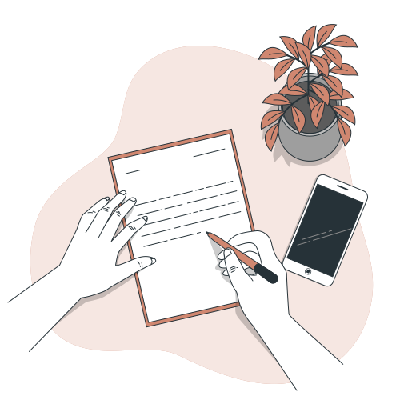
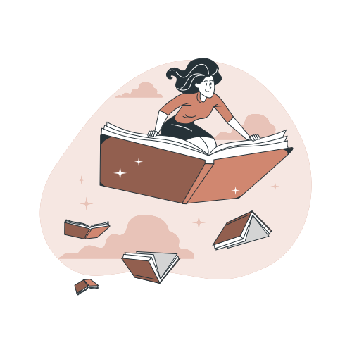
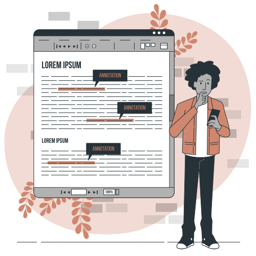
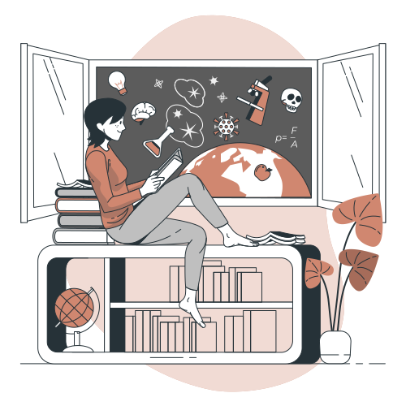
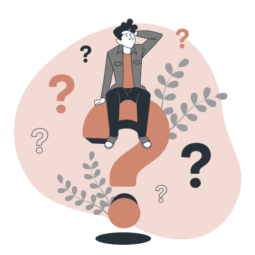
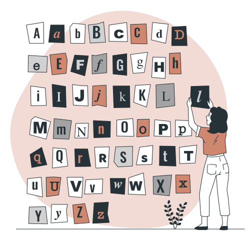
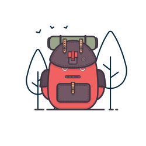

## Welcome to Knapsack 👋

Welcome to the inaugural edition of Knapsack, a bi-monthly letter for friends and followers.

I will share things that I found interesting over the last fortnight. I hope you find something useful in these pieces that you can learn about.

**Why a newsletter?**

My first task in my first job was to write an article for my company's newsletter. I am not sure on what I wrote about then; only that it had a few typos and a couple of rather awkward sentence constructions. Soon, the newsletter responsibility became part of my job and it was an interesting exercise.

I had to compose the newsletter in Word and I had complete freedom in the topics that went in except for the letter from the CEO which I sometimes ghost-wrote. Once approved, I had send it to the printer, proof a sample copy, and then approve for printing. The newsletters were then mailed to clients and the sales team always carried a few copies to give out to prospective leads. Though I'm not sure if someone decided to give their business to us after reading the newsletter 🙂, but I've been summoned by the CEO to explain the newer technologies.

The newsletter role gave me the headstart I needed to understand the new technologies. And that's how I got into blogging and the Internet culture and the rest of my career took off from there.

Recently, I find myself writing privately than for public consumption. To turn full circle, I wanted to rediscover that feeling of putting out a newsletter that others can read and benefit from. And this gives me an opportunity to write better and practice my craft.

When I decided to start up this new experiment, I had reached out to some friends asking them what would they expect from me if I had to send them a newsletter. Most of them wanted me to cover books, reading, and writing (in that order) 😀. Some wanted me to cover my thoughts on technology and interesting tools.

As I started collating content for this newsletter, I found myself with pieces that seemed to address the needs of my target audience, even though it was just a handful.

So I decided to start simple and build from there. The following issues will include something for everyone, I can promise that much.

I am very excited about this newsletter and I would really love any feedback on this experiment.

---
## 📗 Book Bites: Soundtracks by Jon Acuff

As someone who always has music playing in the background, this book's cover image of The Thinker with a headphones appealed to me a lot. I do pick books based on their covers. 😄

Everyone is prone to overthinking. Jon Acuff calls those repetitive thoughts as  <b><i>soundtracks</i></b>.

Soundtracks are those repetitive thoughts that play automatically in your head and which drive the choices you make. Unfortunately, most of the times, our soundtracks tend to be negative.   

We have the choice to choose which soundtracks we want to listen to. To make our soundtracks positive, we have to **retire** the broken ones and **replace** them with newer ones and **repeat** the process frequently.

---

## 💬 Quotable Quote

>[!info]-
>I will share a quote that I found thought-provoking . Most of these quotes are from books that I've read.

>[!quote] 
>Stories never live alone; they are boundaries of a family that we have to trace back, and forward. - Roberto Calasso, *The Marriage of Cadmus and Harmony*

Roberto Calasso was an Italian writer who dealt with the relationship of myth and humanity in his works. I've read his *The Marriage of Cadmus and Harmony* which deals with the Greek myths. He had written a book about the Indian myths titled, *Ka: Stories of the Mind and Gods of India*, which I started and read a few pages and never moved forward. 🙁

Roberto Calasso passed away recently on July 28, 2021.

  
 ---

## 🤯 Random Useless Fact

>[!info]-
> I think I know many facts about many things. In this section, I will share the ones that I found interesting. Most of these facts do not have any practical usage but maybe you can regale someone with these random useless facts. 😉

Before DNA tests were invented, scientists used [Phenylthiocarbamide](https://en.wikipedia.org/wiki/Phenylthiocarbamide) (PTC) for determining genetic connections between individuals. PTC has an interesting property: it tastes very bitter or is tasteless depending on the genetic makeup of the taster. 🤯

Another use of PTC is to grow transparent fishes. 😕

---

## 🤔 Question to Ponder

>[!info]-
>I will share a question that has led me to spend some time thinking about it. It doesn't matter if I find an answer to it. What matters is the thinking behind that question.

I read this blog post, [Questioning a purchase](https://m.signalvnoise.com/questioning-a-purchase/) some time back and it has remained in my mind a long time, especially when I am looking for solutions to a problem.

>[!question]
>What problem am I trying to solve? How does this help me get there?
>>This question is an old friend. A constant companion as I muddle my way through life. What am I trying to do? Do I know? Child questions spawn, dragging me closer to an imperfect answer that works for now. There is something powerful about the way asking a question reveals flaws in my understanding, or illuminates new avenues to explore. The beautiful thing is, behind each answer I find more questions.

There are a few more questions in that article that you can try asking during problem-solving.

---

## 🔍 Strange New Word: croggle

I came across this word in _Shadow Games_ by Glen Cook.

***croggle*** (verb)
- to astonish, bewilder, baffle
- Blend of crush + goggle or perhaps crush + boggle

Example:
- I was croggled to see people wandering about without masks.

More about [croggle](https://www.wordsense.eu/croggle/)

---

![[assets/links.svg]]

## 🌐 Interesting Links

- Have you ever wondered what was the oldest business organisation in the world? Before its liquidation, [Kongō Gumi](https://worksthatwork.com/3/kongo-gumi) was the oldest continuously operating company in the world. Founded in Japan a mere century after the fall of the Roman Empire, it survived extreme changes in Japan’s culture, government and economy, preserving traditional construction techniques and family values for over 1,400 years. 
- Do you know what 'counterfeit consciousness' means or what about 'colossal information'? Researchers have found that most papers published recently has strange wordings for some common words like 'artificial intelligence' or 'big data'. Their research led to them identifying the culprit: automated translations software to disguise plagiarism. Link to article: [‘Tortured phrases’ give away fabricated research papers](https://www.nature.com/articles/d41586-021-02134-0) 😮

---

## ⌛ Blast from the Past
These are pieces of writing I did a long time back when I was blogging actively. I am resurfacing posts that still make sense. I wrote this following post on April 18, 2006. I find my thoughts on this still valid and true even today. [Note: The only edits I made to the article here were fixing a couple of typos from the original article.]

###### a blank mind
What constitutes writing? Is it just the act of putting ink to paper? Or is it an act of love, putting into words what the eyes see and what the mind imagines? Stephen Leacock once said, “_Writing is no trouble: you just jot down ideas as they occur to you. The jotting is simplicity itself – it is the occuring which is difficult._”

Right now that is what I am experiencing: the difficulty of having thoughts to jot down. I sit down to write. I put pen to paper and find that I cannot. My mind, till that moment, had been bustling with ideas is now blank. I cannot recall what my thoughts had been till then. Is this what they call a ‘writer’s block’?

Ideas hover on the borders of my mind. I run towards it and Poof! It is gone, disappeared. Incomplete works occupy my desk. And this feeling is playing havoc with my mind. I have become restless, listless, and prone to anger and melancholy. Sometimes I feel that I am losing myself in this senseless chaos. Then I decide I need to be inspired. I search for it in movies, books, and music. No it isn’t there. Instead it drives me towards desperation.

I wonder when I would be back again.

---

## ℹ️ Why Knapsack?

The title _knapsack_ is a wordplay on the words, _knap_ and _quiver_.

knap
- To shape a brittle material having conchoidal fracture, usually a mineral (flint, obsidian, chert etc.), by breaking away flakes, often forming a sharp edge or point. (via [knap - Wiktionary](https://en.wiktionary.org/wiki/knap#English))

knapsack (_knap_ + _sack_)
- A case of canvas or leather, for carrying items on the back. (via [knapsack - Wiktionary](https://en.wiktionary.org/wiki/knapsack#English))

To make an arrow head, you had to knap stones like obsidian or flint. And a quiver is just a bag/sack of arrows. Since my domain is called paperarrow, I wanted to use something that links to it. 😋

---

Till the next issue,  
Bye and stay safe 😷 

Xavier

