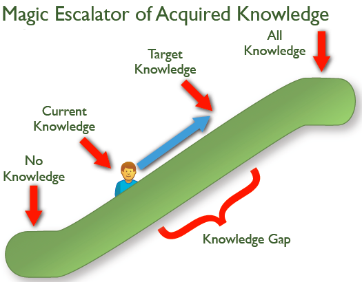

## Welcome to Knapsack 👋

Hello again, 

My site, [🌐 Paper Arrow](https://paperarrow.com) turned a dozen years old on August 17. 🎂 🎉

When I started this experiment, it was a journey [into the unknown](../01/). I've got some good responses from you and it has given me some impetus as I continue this journey 🚀. 

The first issue covered somewhat generic topics. As I started putting together the second issue, I wanted to ensure that there is a good mix of technical articles and abstract ideas. This time around, I've added a couple of articles that are more technical writing oriented. Upcoming issues will be more oriented towards user assistance and user experience also. I also have some plans to write an issue focussing on one specific topic.

So I'll be swapping out a few sections from the first issue with new different sections. Don't worry, those sections will be making their appearances in future issues. 

I would really love any feedback on this experiment and also share this with others who might find this useful. 🙏

>P.S. If you are a Clubhouse user, I host a club with a couple of friends every weekend. We usually talk about topics that affect us as part of the technical writing community and share thoughts on them. You can find us at [🗣️ PaperArrow](https://clubhouse.com/club/paper-arrow). We would love to have you on board and get your perspectives on topics.

---

## 📗 Book Bites: Power Hour by Adrienne Herbert
>[!info]-
>I will share either a condensed version of a book or any actionable information from a book.

In Power Hour, Adrienne Herbert says that the first hour of each day should be devoted to your goal or passion. Spending this *Power Hour* everyday working on what you are passionate about can help you.

[ 📗 Power Hour by Adrienne Herbert](https://amzn.to/3jtCjAk)

Ask yourself these **Six Morning Questions**:

- What energy do you want to have today?
- From whom can you learn?
- Who can you help?
- How can you get closer to where you want to be a year from now?
- What are you most looking forward to today?
- What are you most grateful for today?
  
I felt answering these six questions would help in ensuring that the day gets off to a great start.

---

## 💬 Quotable Quote
>[!info]-
>I will share a quote that I found thought-provoking . Most of these quotes are from books that I've read.

>[!quote]
>Curiosity is of two sorts: that based on interest which impels us to discover what may be to our advantage, and that based on vanity which is caused by our desire to know more than our neighbor. - François de La Rochefoucauld, *Maxims*

I found this quote something to think about. 
>[!question]
>Which sort of curiosity should we have? Are they mutually exclusive?

 ---

## 💡 Ideas to Implement: Magic Escalator of Acquired Knowledge

>[!info]-
> Ideas to Implement will cover topics or ideas that I've been pondering upon for a while. I will make them as actionable as I can. I hope these ideas give you a starting point to build something based off it.

The *Magic Escalator of Acquired Knowledge* is a tool that you can add to your writing toolkit.

As technical writers, a core task is providing information to users - be it a concept to be explained or how to do something. 

Acting as an escalator, a good writer can take someone from the bottom (*No Knowledge*) to the top (*All Knowledge*). 

Most times, we focus on moving the reader to the _All Knowledge_ section instead of bridging the _Knowledge Gap_. We go overboard trying to ensure that we explain everything that can be said for a given topic. But in most cases, no one starts from scratch. They would have some kind of working knowledge beforehand (*Current Knowledge* - what someone knows about a topic). Now the task becomes moving them up to the *Target Knowledge* level (where they have knowledge that is useful for them to get their work done). 

I first heard about this idea when [📝 Jared Spool wrote about this](https://articles.uie.com/magic_escalator/) nearly a decade back.

---

## 🔍 Strange New Word: cardician
>[!info]-
>As an avid reader, I come across a lot of strange new words (at least to me) during my reading._

I came across in _[📗 Justice League Dark Vol. 1: The Last Age of Magic](https://amzn.to/3gILHOH)_.

***cardician*** (plural cardicians) (noun)
- One who performs card tricks.
- Blend of _card_ + _magician_

---

## 🧰 Practical Procedures: Create a self-updating PDF index

>[!info]-
> Practical Procedures will try to provide some information on how to do a specific task. I'll be putting out only things that I've tried and tested so you know that it works 😉.

>[!tip]
>This procedure can be used across domains not just technical writing. This approach works anywhere where you have a large number of PDFs and you want to search for something in all of them. Think of use-cases like lawyers searching cases for previous judgements, students with electronic books.

When you have a large number of PDF files that you frequently use or want to run searches on, the **Catalog** feature in Adobe Acrobat allows defining a specific group of PDFs as a _catalog_ and create a unified index for that entire collection of documents. When users search the cataloged PDFs for specific information, the index makes the search process much faster.

Sometime back, someone asked me if there was a way to build an self-updating index of PDF files. Piqued, I went about to find if this was possible and found very scant information about that process. A couple of hours later and several forays into ancient forum posts led me to a solution.

When an index file is built, Acrobat creates a file with *.pdx* extension and a new support folder, which contains one or more files with *.idx* extensions. The IDX files contain the index entries. See [🌐 How to create an index ](https://helpx.adobe.com/in/acrobat/using/creating-pdf-indexes.html#create_an_index_for_a_collection_acrobat_pro) for steps.

This works great till you have to add some more PDFs to the index. Now, you have to revise the index to pick up the new files. The [🌐Revise an index ](https://helpx.adobe.com/in/acrobat/using/creating-pdf-indexes.html#revise_an_index_acrobat_pro) topic describes how to do that. This is a tedious process whenever you find yourself running this reindexing frequently. 

Luckily, there is a partially documented feature that allows automatic reindexing. 😲 The Adobe Help doesn't do a good job of explaining how to do that. It merely states that you can use a batch PDX (.bpdx) file with Windows Scheduler to perform an automatic reindexing.

The only useful info I could find was a note:
> To use BPDX files, in the **Preferences** dialog box under **Catalog**, select **Allow Catalog Batch Files (.bpdx) To Be Run**.

It does not tell you how to create that .bpdx file. 😠 So how do we create one?

### How to create a BPDX file?
- Create an empty text file and rename the extension from .txt to .bpdx, say `rebuild-index.bpdx`.
- Add the following command to the file.
	- `FULL PATH TO PDX FILE.pdx /rebuild`
		- Ensure the path does not contain quotation marks like `"C:\users\xavier\testing-pdf-index.pdx" /rebuild`. It should be `C:\users\xavier\testing-pdf-index.pdx /rebuild`.
### How to run this BPDX file?
 - Verify that you can reindex with the command:
	 - `"C:\Program Files (x86)\Adobe\Acrobat 9.0\Acrobat" C:\users\xavier\rebuild-index.bpdx`
	 - If Acrobat opens and regenerates the index, you're doing great 👍.

Next, you can add this to a Windows Scheduler with the "Start a Program" action and the path to the Acrobat.exe file as the program name and the path to the BPDX file as the argument. 

Go make a ☕ and enjoy automatic index rebuilds ✨ everytime you add a PDF to the catalog.

---
## 🤔 Question to Ponder

>[!info]- 
>I will share a question that has led me to spend some time thinking about it. It doesn't matter if I find an answer to it. What matters is the thinking behind that question.

>[!question]
>Why don’t companies train people to question, and create systems and environments that would encourage them to keep doing so?

This question comes from the book, _A More Beautiful Question_ by Warren Berger. As innovation becomes a major differentiation factor, fostering an environment of questioning the status quo becomes a key factor in an organisation's success.

---

Till the next issue,  
Bye and stay safe 😷 
Xavier
