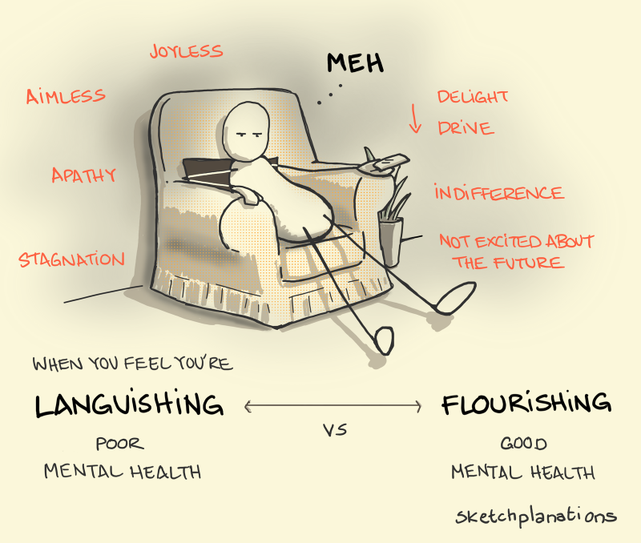

## Welcome to Knapsack 👋

Hello readers,

In this issue, I wanted to talk about something that we all take for granted - our mental health. The day I'm publishing this is a day off from my work. My company has designated the last Friday of October as a Mental Wellness Day. We started this last year and hope to continue this every year.

I feel mental health is something that we are afraid to talk about. There have been days these past couple of years, ever since we started working from home, when I really did not have the energy to do anything. Though work is always present, I wasn't really feeling up to doing it. 

Most of the people I had spoken with said the same: the days blurring into each other, the lack of social contacts, the everpresent need to be productive at work, and the presence to be with people at home had been taking the toll on everyone's mental health.

So for this issue, I just wanted to highlight things that I had been thinking of and some things I've been trying to stay afloat.

And I'm taking a break and Knapsack will be back in January 2022.

Thanks,
Xavier

---

## 📗 Book Bites: The Headspace Guide to Meditation and Mindfulness by Andi Puddicombe

  

[📗 The Headspace Guide to Meditation and Mindfulness](https://amzn.to/3oazsNx)
 

  

  Mindfulness is the willingness to rest in that natural state of awareness, resisting the temptation to judge whatever emotion comes up, and therefore neither opposing or getting carried away with a feeling. Meditation is simply the exercise that is going to give you the best conditions to practice being mindful of these emotions. And headspace is the result of applying this approach. 
  
  If mindfulness is the ability to be present, to rest in the moment whatever you’re doing, and meditation is the best way of learning that skill, then **headspace** could be considered the outcome.

  

Andi Puddicombe has an app called [📱Headspace - app](https://www.headspace.com/) for guided meditation and sleep. He also has a Netflix series, [📺Headspace Guide to Meditation on Netflix](https://www.netflix.com/title/81280926).

---

## 🔍 Strange New Word: acedia

***Acedia***:  a strange combination of listlessness, undirected anxiety, and inability to concentrate.

*[Acedia](https://en.wikipedia.org/wiki/Acedia)* comes from a combination of the negative prefix *a-* and the Greek noun *kēdos*, meaning "care, concern, or grief." (The Greek word *akēdeia* became **acedia** in Late Latin, and that spelling was retained in English.) Acedia initially referred specifically to the "deadly sin" of sloth. It first appeared in print in English in 1607 describing ceremonies which could induce this sin in ministers and pastors, but that sense is now rare. Acedia now tends to be used more generally to simply imply a lack of interest or caring, although it sometimes still carries overtones of laziness.

---

## 🎶 Earworm: Sit Here and Love Me by Caroline Spencer

I first heard this song when it came out in 2019. But since this August, this has been one of my most-played song on Spotify these past few months.

<iframe width="560" height="315" src="https://www.youtube.com/embed/nawN3ZHsLok?si=tszUWdz3TGhhKHAC&amp;controls=0" title="YouTube video player" frameborder="0" allow="accelerometer; autoplay; clipboard-write; encrypted-media; gyroscope; picture-in-picture; web-share" referrerpolicy="strict-origin-when-cross-origin" allowfullscreen></iframe>
Caroline Spence explains the song, “I’m dating someone with an incredibly sunny disposition, and as a person who deals with depression and anxiety, I’ve had to explain all that to him while knowing he might never fully understand it. That song is my way of saying, ‘Don’t worry, it’s okay – you don’t have to try and fix anything for me. Just be exactly how you are.'”

I've been recommending this song whenever some one says they're feeling down. Please listen to it. It is a very beautiful song on dealing with mental health issues.

---

## 💬 Quotable Quote

> Having leisure at one’s disposal does not improve the quality of life unless one knows how to use it effectively, and it is by no means something one learns automatically … Human beings feel best in flow, when they are fully involved in meeting a challenge, solving a problem, discovering something new. - Mihaly Csikszentmihalyi, *[📗 Finding Flow](https://amzn.to/3bQAp8a)*

Mihaly Csikszentmihalyi formulated the psychological concept of [flow](https://en.wikipedia.org/wiki/Flow_(psychology)), a highly focussed mental state that is key to being productive. Every major productivity book would cite his seminal work on flow as a path to being productive. Mihaly passed away last week on October 20, 2021.

---

## 🧰 Tool Talk - Medito

Since the start of this year, I have been trying to get in a meditation habit. After a few false starts with my Fitbit's meditation feature and a couple of other apps like Headspace and [🌐 10% Happier](https://www.tenpercent.com/), I discovered [📱 Medito](https://meditofoundation.org/medito-app) and it seemed to tick all of my needs.

Built by the Medito Foundation as a free app, it sort of gently guides you into a meditative practice through short sessions. I've been using it regularly over the course of this year though I had lapsed more than a couple of times. 🙁 But I keep returning to it always and it has been helpful. 

The one thing that I liked about it is that it has these packs for different issues like anxiety or stress which I found useful. The best part is that these packs or sessions are available on their [🌐 Medito website](https://meditofoundation.org/meditations). You can always visit their website for a quick session during the workday. 

---

## 🌐Interesting Links: Languishing

Earlier this year, I came across this article by Adam Grant in the New York Times: [📰 Feeling Blah During the Pandemic? It's Called Languishing](https://www.nytimes.com/2021/04/19/well/mind/covid-mental-health-languishing.html). And the article introduced the word for the emotion most of us had been feeling over the course of these past two years.

You can also listen to Adam Grant talk about it in August 2021: [🎤 How to stop languishing and start finding flow](https://www.ted.com/talks/adam_grant_how_to_stop_languishing_and_start_finding_flow).

[^languishing-sketch]
[^languishing-sketch]: Languishing sketch by [🎨 Jono Hey](https://sketchplanations.com/languishing)
--- 

That’s it for this issue! If you found something useful, **share it with a friend**. If you have thoughts or suggestions, just reply—I’d love to hear from you.

Till the next issue, 
Bye and stay safe 😷 
Xavier
