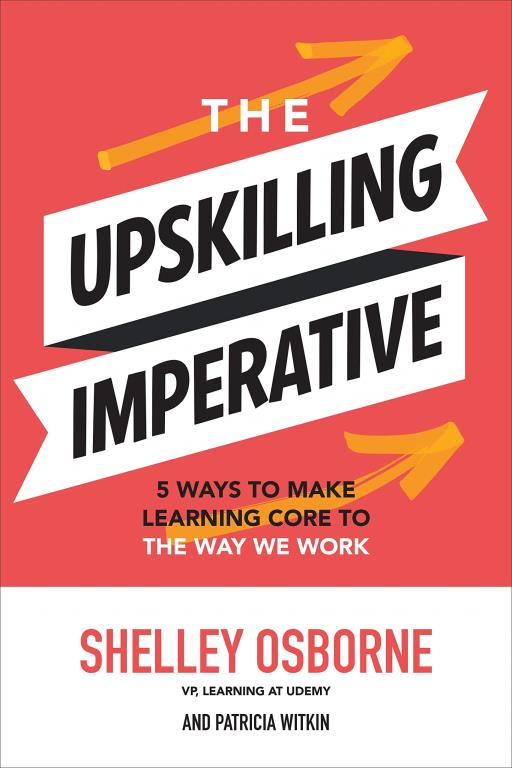
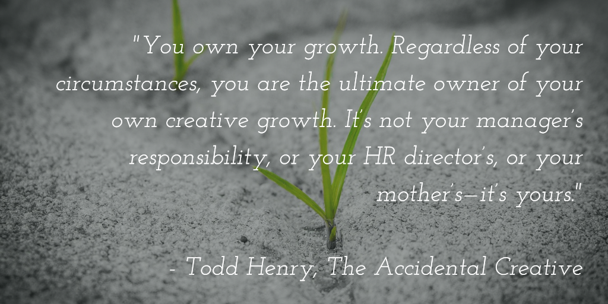

### Welcome to Knapsack 👋

Hello readers,

I wish you all a very happy and prosperous new year in 2022. 

As 2022 begins, there is still no end in sight for this pandemic. Newer strains will keep coming up and hopefully less virulent than the previous strains. Yet we have made progress from being shut inside our homes to a situation where we can head outside to meet friends and families. 

With work-from-home being extended across most organisations, going back to office seems to be a mirage. Informal meetups and maybe working lunches might be the trend this year.

Like the [last issue](../05/), I have been trying out a theme-specific issues. For this issue, I've chosen the theme of learning and upskilling. As a professor of mine at college used to say, *A man who stopped learning yesterday is an illiterate tomorrow*. Keep learning.

Thanks,
Xavier

---

### 📚 Book Bites: The Upskilling Imperative by Shelley Osborne

Shelley Osborne is [Udemy](https://www.udemy.com/)'s Vice President of Learning. In her book [📗 The Upskilling Imperative](https://amzn.to/3EGKVup), she reveals the methods she uses to help many of today’s leading companies―from Adidas to PayPal to Barclays―build and sustain a culture of learning.

  

  

  

 With techniques supported by the latest learning science, she lists five steps for transforming a business into an industry powerhouse:

1. Create an environment of freedom, opportunity, and love of learning.
2. Use honest, forthright feedback to fuel your new learning culture.
3. Clearly communicate the rewards that come when we approach our job as a learning adventure.
4. Build learning into the everyday workflows and operations.
5. Manage your new learning culture in a sustainable way.
  

  

---

### 🔍 Strange New Word: swot

***swot*** (verb)
- to study something with effort or determination.

Not to be confused with [SWOT analysis](https://en.wikipedia.org/wiki/SWOT_analysis). 🙂

Learn more about [📝 swot](https://www.wordsense.eu/swot/).

---

### 💡 Ideas to Implement: Personal Learning Curriculum

The modern knowledge worker requires frequent updates to their skills. The most asked question in many forums across the web is *How do I know what skills should I update?* and *How do I update those skills?*.

I would suggest you start by creating your **Personal Learning Curriculum**. It is a good way to approach learning that is tailored to you. 

The first step would be to **identify key skills that you want to learn**. If you are trying to improve your chances of being promoted or getting a job at your dream company, the first task you can do is find out what that role requires. Does it require you to possess some SQL knowledge or does it require you to be exhibit creative skills? Scouring old/new job postings and looking out for common items across companies will give you an idea what is the requirement for that role. Make a list of those commonalities.

The second step would be **figure out which of these skills can be learned as part of your current work and which skills require you to learn outside work**. For at-work learning, most often it would be easy to find someone who can help you out. If you need to brush up your database skills, you could probably find someone in your company who is an expert. For outside-work learning, there are lots of sources on the Internet. You could try YouTube or join any MOOC courses. The key point is to identify and learn skills that match the job you're targeting in the first step.

The third step is to find time to **learn and progress** on it. Incremental progress is better than no progress. You choose when you want to learn. Try your hand at any projects that use that skill. You could create a small contacts database to put your new SQL skills to use. If you want, you can find someone to find yourself accountable. 

Doing a lot of side-projects helped a lot in understanding how things work and improve my knowledge. This is a good framework that I've adopted to learn.

The idea is to build your own personal learning curriculum that is uniquely suited to you and your aspirations and one that offers you the best learning experience and benefits.

---

### 💬 Quotable Quote

<!--

-->

> “You own your growth. Regardless of your circumstances, you are the ultimate owner of your own creative growth. It’s not your manager’s responsibility, or your HR director’s, or your mother’s—it’s yours.” - Todd Henry, *The Accidental Creative*

---

### 🤔Question to Ponder

>[!question] 
>What am I being paid for?

As part of my contract with my employer, I am paid a salary every month. But what are they paying me for: to put words on pages or for my insights/ideas?

---

That’s it for this issue! If you found something useful, **share it with a friend**. If you have thoughts or suggestions, just reply—I’d love to hear from you.

Till the next issue, 
Bye and stay safe 😷 
Xavier
