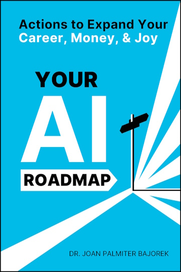
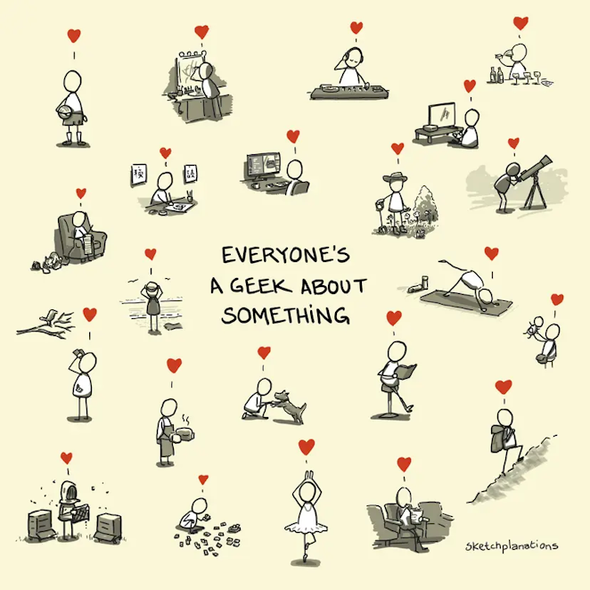

## Welcome to Knapsack 👋

Hello again,

Last week, I gave a talk on the challenges of writing documentation for both **humans and AI**. As I reflected on it, I realized that this isn't just about documentation—it’s about how we shape communication for different audiences, be it people or machines.

When I started writing online, I assumed my words would only reach other humans. Now, AI systems are parsing, summarizing, and even making decisions based on documentation. This shift raises fascinating questions: How do we write so both humans and AI understand? How do we ensure meaning isn't lost in translation?

These are some of the ideas explored in this issue. We also have a book on AI careers, a curious new word about solitude, and a question to ponder.

If you enjoy this issue, **share it with a friend, or better yet, reply and let me know what you think**.

Let’s dive in.

---

## 🗣️Deep Dive: Writing Documentation for AI and Humans

I recently presented a talk, **"Documentation for AI and Humans: Writing for AI and Human readers,"** which focused on the evolving landscape of technical communication in the age of AI.

**Key takeaways from the talk:**

- **The Rise of AI Agents**: AI systems, particularly AI agents, are increasingly consuming and acting on technical documentation.
    
- **Human vs. AI Processing**: Humans and AI process information differently, which has profound implications for documentation.
    
- **Dual-Audience Strategies**: How to write documentation that serves both humans and AI effectively.
    
- **The Future of Documentation**: The role of the technical writer is changing—what does that mean for the industry?
    

If this piques your interest, you can find more details in my [➡️ LinkedIn post about the session](https://www.linkedin.com/posts/xavierroy_ai-technicalwriting-contentstrategy-activity-7309128106512986112-fkvv).

---

## 📚 Book Bites: Your AI Roadmap by Joan Palmiter Bajorek

_"Your AI Roadmap"_ serves as a modern blueprint for navigating careers and income in the age of AI. Dr. Joan Palmiter Bajorek highlights the importance of **human connections and a well-defined personal brand** as essential tools for career growth, particularly in AI-driven fields.

  

  
  
  

  

The book provides concrete advice on:  
✅ **Leveraging LinkedIn** to showcase expertise and connect with industry leaders  
✅ **Owning your professional story** to stand out in a competitive job market  
✅ **Building financial resilience** through multiple income streams and smart wealth-building strategies

Through personal anecdotes and actionable frameworks, Dr. Bajorek empowers readers to move beyond traditional job-centric thinking and take control of their professional and financial futures.
  

  

**Why this book?**  
In an era where AI is reshaping industries, this book is a valuable guide to future-proofing your career. Whether you're already in tech or looking to pivot, _[📗 Your AI Roadmap](https://yourairoadmap.com/)_ offers practical steps to help you stay ahead.

---

## 🔍 Strange New Word: Isolophilia

I came across the word **isolophilia** while looking for background music to write to: [🎵 Isolophilia on YouTube](https://www.youtube.com/watch?v=aSgrT-TfowA&ab_channel=timeofyouth).

<iframe src="https://www.youtube-nocookie.com/embed/aSgrT-TfowA?rel=0&amp;autoplay=0&amp;showinfo=0&amp;enablejsapi=0" frameborder="0" loading="lazy" gesture="media" allow="autoplay; fullscreen" allowautoplay="true" allowfullscreen="true" width="728" height="409"></iframe>

📖 **Meaning:** A strong affection for solitude and being alone.

While solitude is often seen as loneliness, **isolophilia** suggests a deep appreciation for being alone—not as isolation, but as a chosen state. It’s the joy of a quiet evening with a book, the comfort of an early morning walk before the world wakes up, or the satisfaction of working on a project uninterrupted.

> [!question] 
> Do you identify with isolophilia? Or do you find energy in company?

---

## 🖼️ See What I See: Everyone is a Geek in Their Own Way

This issue’s image is a sketch from **[🖼️ Sketchplanations: Geek](https://sketchplanations.com/geek)**.

It reminds me that **everyone is a geek about something**. Some geek out over the **stars**, others about **sketching**, **languages**, or even **earthworms** (which, by the way, are fascinating—[Darwin once spent 39 years](https://charles-darwin.classic-literature.co.uk/formation-of-vegetable-mould/) studying them 🤯.

Being a geek isn’t about a specific interest; it’s about **curiosity and deep engagement**.

> [!question]
> So, what’s something you geek out about?

---

## 🤔 Question to Ponder

💭 **What is one skill or habit you wish you had started earlier?**

We often look back and realize that certain small habits or skills—journaling, exercising, learning a language—would have made a huge impact if we had started earlier. But it's never too late.

> [!question] 
> What’s one thing you’d start today if you knew you’d stick with it?

---

That’s it for this issue! If you found something useful, **share it with a friend**. If you have thoughts or suggestions, just reply—I’d love to hear from you.

Till next time,   
Xavier